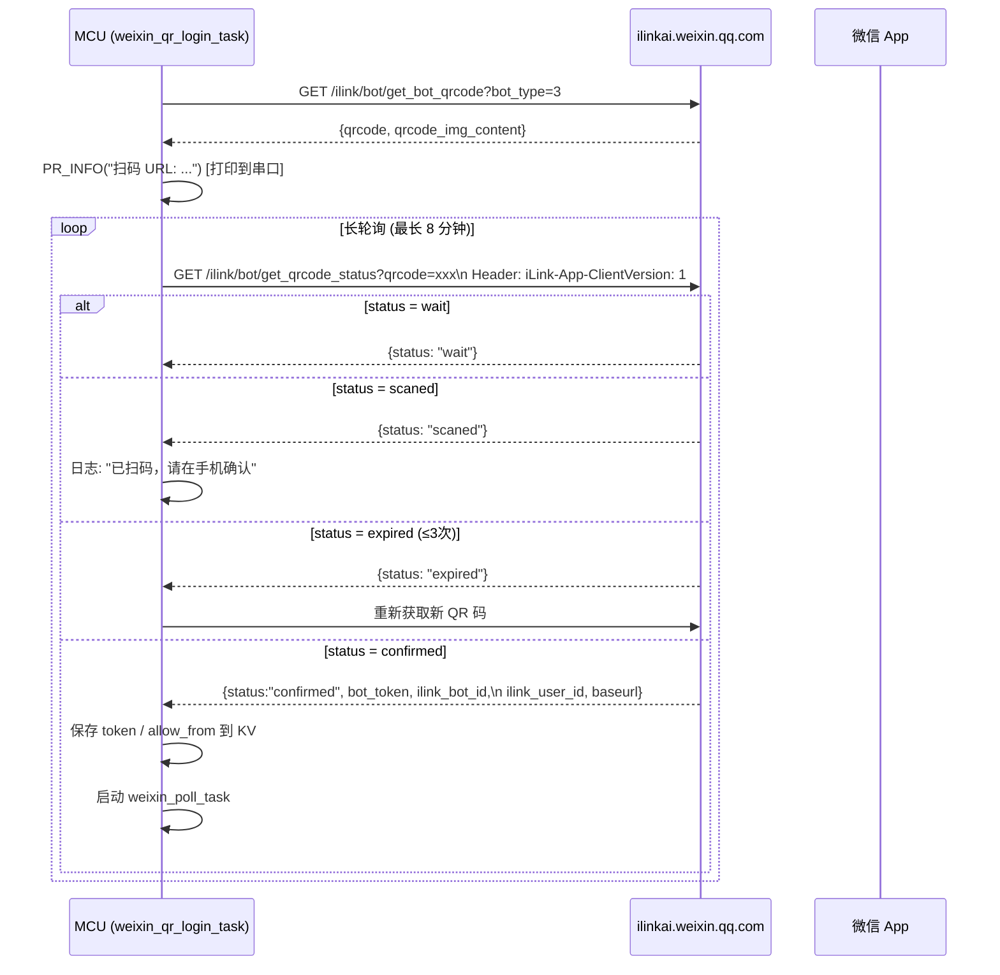
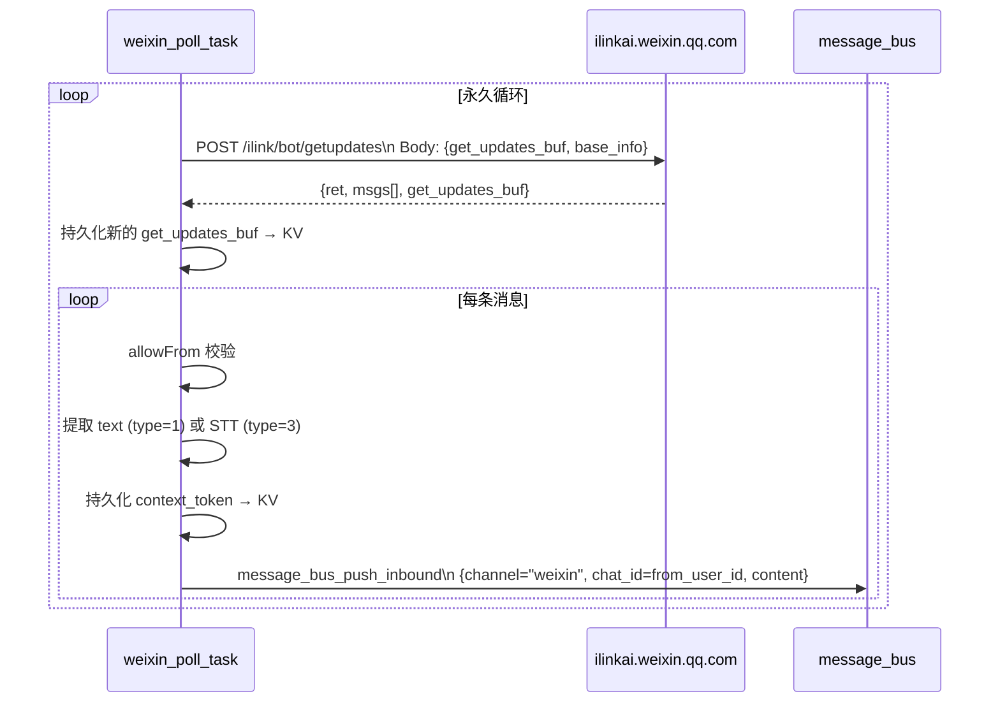
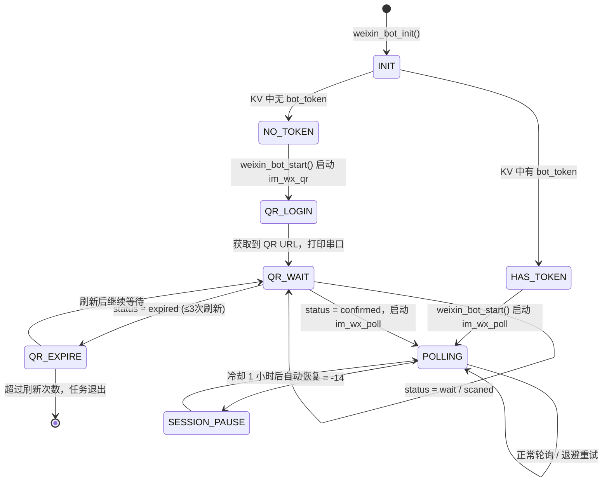
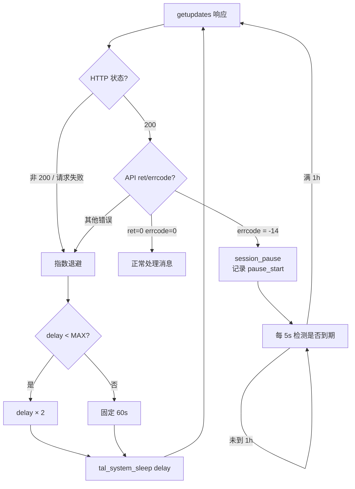

# Weixin (WeChat) iLink Bot Channel

`weixin_bot.c / weixin_bot.h` 实现了微信 iLink Bot 协议，将其接入 DuckyClaw IM 组件的统一消息总线。

---

## 目录

1. [整体架构](#整体架构)
2. [QR 扫码登录流程](#qr-扫码登录流程)
3. [消息收发流程](#消息收发流程)
4. [任务与线程模型](#任务与线程模型)
5. [关键配置项](#关键配置项)
6. [KV 持久化存储](#kv-持久化存储)
7. [HTTP 请求结构](#http-请求结构)
8. [错误处理与退避策略](#错误处理与退避策略)
9. [接入步骤](#接入步骤)

---

## 整体架构

```mermaid
graph TD
    A[app_im.c] -->|channel_mode = weixin| B[weixin_bot_init]
    B --> C[weixin_bot_start]

    C -->|已有 bot_token| D[weixin_poll_task\n长轮询任务]
    C -->|无 token| E[weixin_qr_login_task\nQR 登录任务]
    E -->|确认成功| D

    D -->|POST getupdates| F[ilinkai.weixin.qq.com]
    F -->|msgs[]| D
    D -->|push inbound| G[message_bus\ninbound queue]
    G --> H[AI Agent / App 逻辑]

    H -->|push outbound| I[message_bus\noutbound queue]
    I -->|pop| J[outbound_dispatch_task\napp_im.c]
    J -->|weixin_send_message| K[POST sendmessage]
    K --> F
```

---

## QR 扫码登录流程

微信 iLink 采用两步 QR 登录。设备无需显示屏，通过串口日志打印 URL 供用户在 PC 浏览器打开后扫码。



> **关键细节**
> - `get_qrcode_status` 是服务端长轮询（server-hold），超时约 35 s，正常返回 `wait` 后直接继续循环，无需额外 sleep。
> - `ilink_user_id`（扫码确认者）自动写入 `allow_from`，后续只有该用户的消息会被处理。
> - QR 码过期后最多刷新 `IM_WX_QR_MAX_REFRESH`（默认 3）次，超过后放弃并退出任务。

---

## 消息收发流程

### 接收（Inbound）



### 发送（Outbound）

`app_im.c` 的 `outbound_dispatch_task` 从总线 pop 消息后调用 `weixin_send_message()`：

```c
/* app_im.c outbound_dispatch_task 中的 weixin 分支 */
} else if (strcmp(msg.channel, IM_CHAN_WEIXIN) == 0) {
    weixin_send_message(msg.chat_id, msg.content);
}
```

`weixin_send_message` 构造的请求体：

```json
{
  "msg": {
    "from_user_id": "",
    "to_user_id": "<chat_id>",
    "client_id": "wx-<tick>-<rand>",
    "message_type": 2,
    "message_state": 2,
    "context_token": "<持久化的 context_token>",
    "item_list": [
      { "type": 1, "text_item": { "text": "<消息内容>" } }
    ]
  },
  "base_info": { "channel_version": "1.0.3" }
}
```

> `context_token` 来自收到的最后一条入站消息，用于在微信侧关联回复线程。

---

## 任务与线程模型



| 任务名        | 栈大小              | 优先级        | 说明                         |
|--------------|---------------------|--------------|------------------------------|
| `im_wx_qr`  | `IM_WX_QR_STACK`（10 KB）   | THREAD_PRIO_1 | 一次性，完成后自动退出         |
| `im_wx_poll`| `IM_WX_POLL_STACK`（14 KB） | THREAD_PRIO_1 | 永久运行的长轮询主循环         |

---

## 关键配置项

以下宏定义在 `IM/im_config.h` 中，可在 `tuya_app_config.h` 或 `im_secrets.h` 中覆盖。

### 网络与超时

| 宏                          | 默认值                     | 说明                                        |
|-----------------------------|---------------------------|---------------------------------------------|
| `IM_WX_API_HOST`            | `ilinkai.weixin.qq.com`   | API 服务器主机名                             |
| `IM_WX_POLL_TIMEOUT_S`      | `35`                      | `getupdates` 服务端长轮询超时（秒）           |
| `IM_WX_QR_POLL_TIMEOUT_S`   | `35`                      | `get_qrcode_status` 长轮询超时（秒）          |
| `IM_WX_LOGIN_TIMEOUT_MS`    | `480000`（8 min）          | QR 登录总超时                                |

### 重试与恢复

| 宏                          | 默认值      | 说明                                              |
|-----------------------------|------------|---------------------------------------------------|
| `IM_WX_FAIL_BASE_MS`        | `2000`     | 首次失败后等待时间（指数退避起点）                   |
| `IM_WX_FAIL_MAX_MS`         | `60000`    | 退避上限（60 s）                                   |
| `IM_WX_SESSION_PAUSE_MS`    | `3600000`  | `errcode -14`（session 过期）后的冷却时长（1 小时）  |
| `IM_WX_QR_MAX_REFRESH`      | `3`        | QR 码过期后最大刷新次数                             |

### 资源与协议

| 宏                          | 默认值    | 说明                                     |
|-----------------------------|----------|------------------------------------------|
| `IM_WX_POLL_STACK`          | `14336`  | 长轮询任务栈大小（字节）                   |
| `IM_WX_QR_STACK`            | `10240`  | QR 登录任务栈大小（字节）                  |
| `IM_WX_MAX_MSG_LEN`         | `4096`   | 入站消息文本最大长度                       |
| `IM_WX_CHANNEL_VERSION`     | `1.0.3`  | 请求体 `base_info.channel_version` 字段   |
| `IM_WX_BOT_TYPE`            | `3`      | `get_bot_qrcode` 的 `bot_type` 参数       |

### 凭据（建议在 `im_secrets.h` 中配置）

| 宏                        | 说明                                       |
|--------------------------|---------------------------------------------|
| `IM_SECRET_WX_TOKEN`     | 预置 bot_token（有则跳过 QR 登录）           |
| `IM_SECRET_WX_ALLOW_FROM`| 预置授权用户 ID（有则无需 QR 确认自动写入）   |
| `IM_SECRET_CHANNEL_MODE` | 设为 `"weixin"` 以启用本渠道                 |

---

## KV 持久化存储

所有状态均持久化在 KV 命名空间 `wx_config`（`IM_NVS_WX`）中，重启后自动恢复，无需重新扫码。

| KV Key（`IM_NVS_KEY_*`）  | 宏名                   | 内容                                  | 最大长度   |
|--------------------------|------------------------|---------------------------------------|-----------|
| `bot_token`              | `IM_NVS_KEY_WX_TOKEN`  | 登录凭据                               | 256 字节  |
| `base_host`              | `IM_NVS_KEY_WX_HOST`   | API 主机名（登录时 `baseurl` 中提取）   | 128 字节  |
| `allow_from`             | `IM_NVS_KEY_WX_ALLOW`  | 授权用户 ID（`ilink_user_id`）          | 96 字节   |
| `upd_buf`                | `IM_NVS_KEY_WX_UPD_BUF`| `get_updates_buf`（消息游标）           | 4096 字节 |
| `ctx_tok`                | `IM_NVS_KEY_WX_CTX_TOK`| 最近一条消息的 `context_token`          | 512 字节  |

---

## HTTP 请求结构

所有 API 请求（POST）携带以下请求头：

```
Content-Type:       application/json
AuthorizationType:  ilink_bot_token
Authorization:      Bearer <bot_token>
X-WECHAT-UIN:       base64(decimal_string(sys_tick))
```

`get_qrcode_status` 额外增加：

```
iLink-App-ClientVersion: 1
```

`X-WECHAT-UIN` 生成逻辑（`weixin_make_uin`）：

```c
uint32_t val = tal_system_get_millisecond();    // 当前系统毫秒 tick
snprintf(dec, sizeof(dec), "%u", val);          // 转十进制字符串
mbedtls_base64_encode(..., dec, strlen(dec));   // Base64 编码
```

TLS 证书通过 `im_tls_query_domain_certs()` 加载；若获取失败则自动回退到 `tls_no_verify` 模式并打印警告。

---

## 错误处理与退避策略



---

## 接入步骤

### 1. 启用渠道

在 `tuya_app_config.h` 或 `im_secrets.h` 中：

```c
#define IM_SECRET_CHANNEL_MODE  "weixin"
```

### 2. 首次运行（QR 登录）

上电后若 KV 中无 `bot_token`，设备自动启动 QR 登录任务。查看串口日志：

```
[weixin] =========================================================
[weixin]   Weixin QR Login
[weixin]   Open this URL in your PC browser, then scan with WeChat:
[weixin]   https://open.weixin.qq.com/connect/qrconnect?...
[weixin] =========================================================
```

用手机微信扫码并确认后，串口输出：

```
[weixin] ✅ Login success! bot_id=xxx@im.bot user_id=yyy@im.wechat
```

此后 token 自动保存，重启无需再次扫码。

### 3. 手动预置 Token（可选）

如已知 bot_token，可跳过 QR 登录：

```c
#define IM_SECRET_WX_TOKEN      "your-bot-token"
#define IM_SECRET_WX_ALLOW_FROM "yyy@im.wechat"
```

或在运行时通过串口 CLI 调用：

```c
weixin_set_token("your-bot-token");
weixin_set_allow_from("yyy@im.wechat");
```

### 4. 强制重新登录

清除 NVS 中的 `wx_config` 命名空间，或调用：

```c
weixin_set_token("");   // 清空 token，下次 start 时触发 QR 登录
```

---

## 文件索引

```
IM/
├── channels/
│   ├── weixin_bot.h          ← 公开 API 声明
│   ├── weixin_bot.c          ← 实现：QR 登录 + 长轮询 + 消息处理
│   └── README_weixin.md      ← 本文档
├── im_config.h               ← 所有 IM_WX_* 宏定义
├── im_api.h                  ← 统一 include 入口
├── bus/message_bus.h         ← IM_CHAN_WEIXIN 定义
└── CMakeLists.txt            ← weixin_bot.c 已加入编译
```

---

## 问题 3：KV 宏含义与必要性说明

### 各宏的含义

| 宏名 | KV Key | 是否必须 | 说明 |
|------|--------|----------|------|
| `IM_NVS_KEY_WX_TOKEN` | `bot_token` | **必须** | iLink Bot 的登录凭据，所有 API 请求的 `Authorization: Bearer` 均依赖它；缺失则无法发起任何请求，设备将触发 QR 登录 |
| `IM_NVS_KEY_WX_HOST` | `base_host` | 可选 | 登录时服务端返回的 `baseurl` 中提取的主机名；若服务端未下发或与默认值相同则为空，实际请求回退到 `IM_WX_API_HOST` |
| `IM_NVS_KEY_WX_ALLOW` | `allow_from` | **必须** | QR 扫码确认者的 `ilink_user_id`；轮询到的每条消息都会校验 `from_user_id` 是否在此列表中，不匹配则静默丢弃，防止无关用户操控设备 |
| `IM_NVS_KEY_WX_UPD_BUF` | `upd_buf` | **必须** | `getupdates` 的消息游标（见下文） |
| `IM_NVS_KEY_WX_CTX_TOK` | `ctx_tok` | **必须** | 最近一条入站消息的会话令牌（见下文） |

### 为什么 `IM_NVS_KEY_WX_UPD_BUF` 需要 KV 存储？

`get_updates_buf` 是服务端维护的**不透明游标字符串**，每次 `getupdates` 响应中都会更新。它的作用类似 Telegram 的 `offset`，告诉服务端"上次已消费到哪条消息"。若不持久化，设备重启后游标归零，服务端会重新下发历史消息，导致已处理的消息被重复推入 AI 流水线，产生重复响应。

### 为什么 `IM_NVS_KEY_WX_CTX_TOK` 需要 KV 存储？

`context_token` 是微信 iLink 协议中用于**关联回复线程**的令牌，由入站消息携带。发送回复时若携带该 token，微信客户端会将回复消息显示在同一会话气泡内，而非独立新消息。若不持久化，设备重启后首条回复将缺失 token，用户会看到一条孤立的消息；后续收到新消息后 token 会自动更新，因此重启仅影响第一条回复的展示效果。
